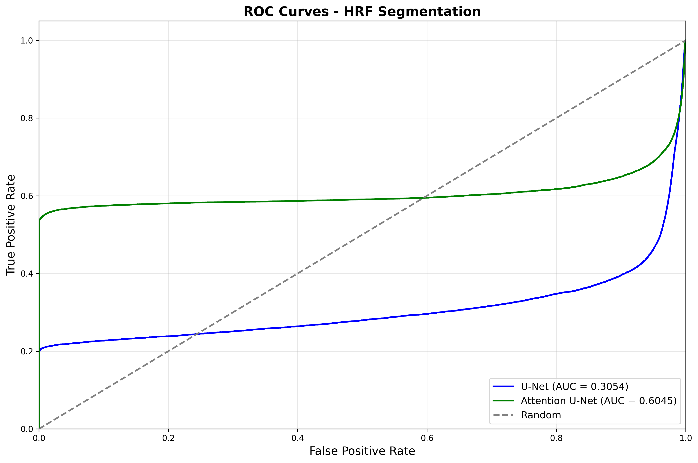
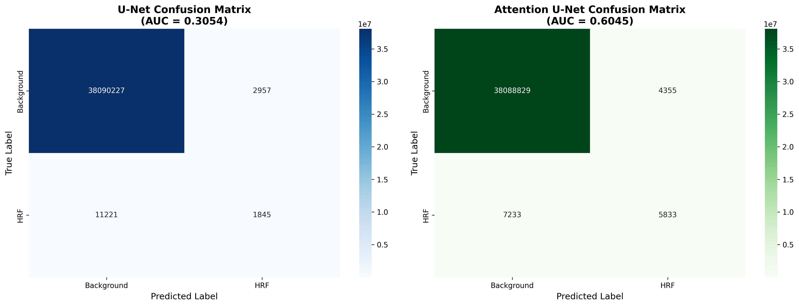

# HRF Segmentation with U-Net and Attention U-Net

[](https://huggingface.co/spaces/AI-RESEARCHER-2024/HRF_Segmentation)

Hyperreflective Foci (HRF) segmentation in OCT retinal images using U-Net and Attention U-Net deep learning models.


## Project Overview

This project implements and compares two state-of-the-art deep learning architectures for automatic segmentation of Hyperreflective Foci (HRF) in Optical Coherence Tomography (OCT) retinal images:

- U-Net: The baseline convolutional neural network architecture for medical image segmentation
- Attention U-Net: An enhanced version with attention gates for improved feature localization

### Key Features

- Dual Model Architecture: Compare U-Net vs Attention U-Net performance
- Live Web Demo: Interactive HuggingFace Space with GPU inference
- Comprehensive Evaluation: Detailed metrics, ROC curves, and confusion matrices
- Reproducible Results: Fixed random seeds and complete training pipeline
- Jupyter Notebook: Comprehensive evaluation pipeline for detailed analysis

---

## Results

### Performance Metrics

| Metric | U-Net | Attention U-Net |
|--------|-------|----------------|
| **Dice Coefficient** | 0.2065 | 0.5017 |
| **IoU (Jaccard)** | 0.1151 | 0.3348 |
| **Precision** | 0.3842 | 0.5725 |
| **Recall** | 0.1412 | 0.4464 |
| **F1-Score** | 0.2065 | 0.5017 |
| **AUC-ROC** | 0.3054 | 0.6045 |

> Note: Evaluation was performed on 65 test images using the provided evaluation notebook.

### Visual Results

<table>
  <tr>
    <td></td>
    <td></td>
  </tr>
  <tr>
    <td align="center"><b>ROC Curves</b></td>
    <td align="center"><b>Confusion Matrices</b></td>
  </tr>
</table>

<p align="center">
  
  <br/>
  <b>Sample Predictions: Original Image | Ground Truth | U-Net | Attention U-Net | Overlay</b>
</p>

---

## Quick Start

### Try the Web Demo

Experience live HRF segmentation in your browser:

**[Launch HuggingFace Space](https://huggingface.co/spaces/AI-RESEARCHER-2024/HRF_Segmentation)**

- Upload OCT images
- Select model (U-Net or Attention U-Net)
- View predictions in real-time
- Download segmentation masks

### Run Evaluation Notebook

1. Clone the repository and navigate to the `evaluation` directory
2. Install the necessary dependencies: `pip install -r requirements.txt`
3. Download pre-trained weights from Google Drive and place them in the specified path
4. Launch Jupyter Notebook: `jupyter notebook HRF_Segmentation_Evaluation.ipynb`
5. Update file paths in the notebook and run all cells to generate results

---

## Repository Structure

```
hrf-segmentation/
├── README.md                          # This file
├── QUICKSTART.md                      # Short setup guide
├── training/                          # Training scripts and code
│   ├── hrfunet.py                    # U-Net training pipeline
│   ├── hrf-aunet.py                  # Attention U-Net training pipeline
│   └── requirements.txt              # Training dependencies
├── evaluation/                        # Evaluation and testing
│   ├── HRF_Segmentation_Evaluation.ipynb  # Comprehensive evaluation notebook
│   └── requirements.txt              # Evaluation dependencies
├── results/                           # Example evaluation results
│   ├── roc_curves.png
│   ├── confusion_matrices.png
│   ├── metrics_comparison.png
│   └── predictions_visualization.png
└── assets/                            # Documentation assets
    └── demo.png
```

---

## Pre-trained Models & Dataset

### Download Pre-trained Weights

Access the trained model checkpoints:

**[Download from Google Drive](https://drive.google.com/drive/folders/1J78I28EzEXMD3jNrusWfuQoCFeFhtZsT)**

The drive contains:
- U-Net/ - U-Net training code and weights
- Attention-UNet/ - Attention U-Net training code and weights

### Model Files

| Model | Filename | Size |
|-------|----------|------|
| U-Net | unet_best_model.pth | ~355 MB |
| Attention U-Net | aunet_best_model.pth | ~361 MB |

---

## Installation & Setup

### Local Setup

```bash
# Clone the repository
git clone https://github.com/ai-research-2025/hrf-segmentation.git
cd hrf-segmentation

# Install dependencies for evaluation
pip install -r evaluation/requirements.txt

# Download pre-trained models
# Place them in the appropriate directories
```

### Dependencies

Core Requirements:
- Python 3.8+
- PyTorch 1.12+
- CUDA 11.3+ (for GPU training)

See individual requirements.txt files in each directory for detailed dependencies.

---

## Usage

### 1. Training Your Own Models

#### Train U-Net
```bash
cd training
python hrfunet.py --data_dir /path/to/dataset --epochs 100 --batch_size 8
```

#### Train Attention U-Net
```bash
cd training
python hrf-aunet.py --data_dir /path/to/dataset --epochs 100 --batch_size 8
```

### 2. Evaluation

Run the Jupyter notebook locally:
```bash
cd evaluation
jupyter notebook HRF_Segmentation_Evaluation.ipynb
```

### 3. Inference

#### Python API
```python
# Refer to training scripts or the evaluation notebook 
# for sample inference and preprocessing implementations.
```

#### Web Interface
Simply use the HuggingFace Space link above for browser-based inference.

---

## Model Architecture

### U-Net

Classic encoder-decoder architecture with skip connections:
- Encoder: 4 down-sampling blocks (64->128->256->512->1024 filters)
- Decoder: 4 up-sampling blocks with skip connections
- Parameters: ~31M

### Attention U-Net

Enhanced U-Net with attention gates:
- Encoder: Same as U-Net
- Attention Gates: Focus on relevant features from skip connections
- Decoder: Attention-guided up-sampling
- Parameters: ~34M

---

## Methodology

### Preprocessing

**U-Net:**
- Simple 0-255 normalization to [0, 1]
- RGB input (3 channels)

**Attention U-Net:**
- CLAHE (Contrast Limited Adaptive Histogram Equalization)
- Z-Score normalization with ImageNet statistics
  - Mean: [0.485, 0.456, 0.406]
  - Std: [0.229, 0.224, 0.225]

Critical: Different preprocessing for each model matches their training regime!

### Training Configuration

- Optimizer: Adam (lr=1e-4)
- Loss Function: Binary Cross-Entropy + Dice Loss
- Data Split: 70% Train / 15% Validation / 15% Test
- Augmentation: Random flips, rotations, elastic transforms
- Random Seed: 42 (for reproducibility)

---

## Evaluation Metrics

The evaluation generates:

1. Segmentation Metrics
   - Dice Coefficient
   - IoU (Jaccard Index)
   - Precision, Recall, F1-Score
   - Specificity, Sensitivity

2. Classification Metrics
   - ROC-AUC curves
   - Confusion matrices
   - True/False Positives/Negatives

3. Visualizations
   - Side-by-side predictions
   - Overlay masks on original images
   - Comparative performance charts

---

## HuggingFace Deployment

The live demo is deployed on HuggingFace Spaces. You can access it directly to test the models with your own images.

**Live Demo**: [HuggingFace Space](https://huggingface.co/spaces/AI-RESEARCHER-2024/HRF_Segmentation)

---

## Contributing

Contributions are welcome! Please feel free to submit a Pull Request.

### Development Setup

```bash
# Create virtual environment
python -m venv venv
source venv/bin/activate  # On Windows: venv\Scripts\activate

# Install development dependencies
pip install -r requirements.txt
```

---

## Citation

If you use this code in your research, please cite:

```text
Pavithra Kodiyalbail Chakrapani, Preetham Kumar, Sulatha V Bhandary, 
Geetha Maiya, Shailaja S, Steven Fernandes, Prakhar Choudhary. 
"U-Net Optimization for Hyperreflective Foci Segmentation in Retinal OCT"
```

---

## License

This project is licensed under the MIT License - see the LICENSE file for details.

---

## Acknowledgments

- U-Net architecture based on Ronneberger et al., 2015
- Attention U-Net based on Oktay et al., 2018
- HRF dataset and medical domain knowledge from ophthalmology research

---

## Contact

For questions or feedback:
- Issues: [GitHub Issues](https://github.com/ai-research-2025/hrf-segmentation/issues)
- Discussions: [GitHub Discussions](https://github.com/ai-research-2025/hrf-segmentation/discussions)

---

## Quick Links

| Resource | Link |
|----------|------|
| **Live Demo** | https://huggingface.co/spaces/AI-RESEARCHER-2024/HRF_Segmentation |
| **Pre-trained Models** | https://drive.google.com/drive/folders/1J78I28EzEXMD3jNrusWfuQoCFeFhtZsT |
| **Paper (U-Net)** | https://arxiv.org/abs/1505.04597 |
| **Paper (Attention U-Net)** | https://arxiv.org/abs/1804.03999 |

---

<p align="center">
  <b>Star this repository if you found it helpful!</b>
</p>
