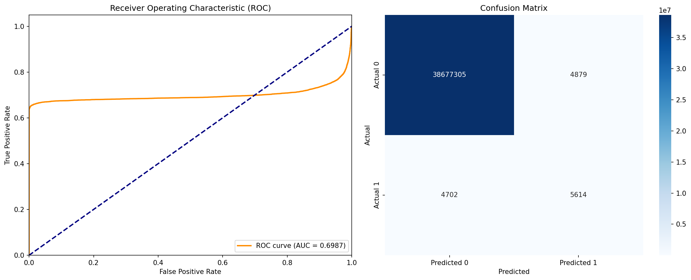
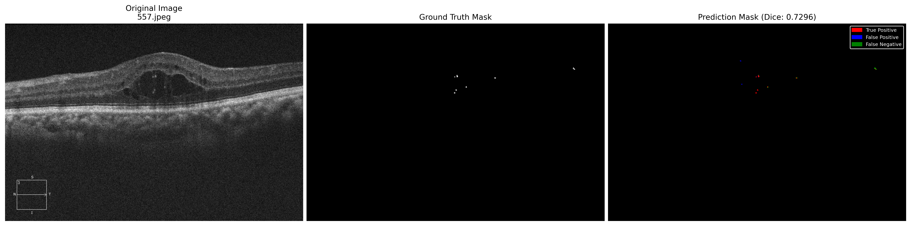
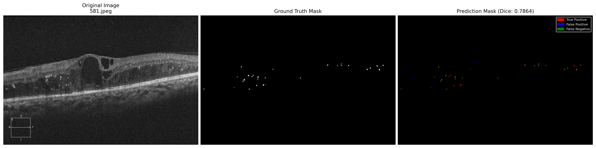
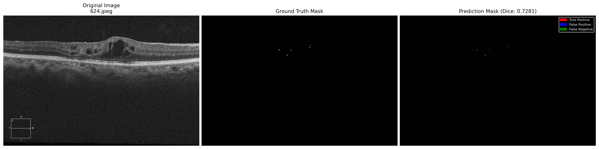
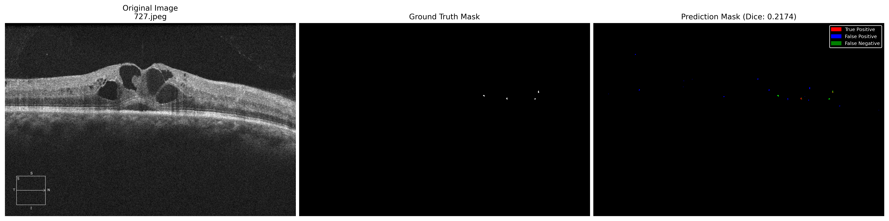
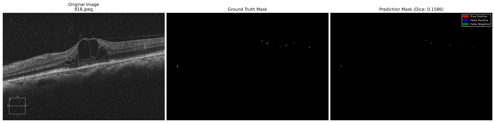
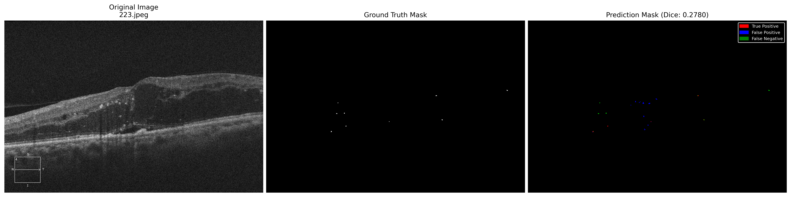
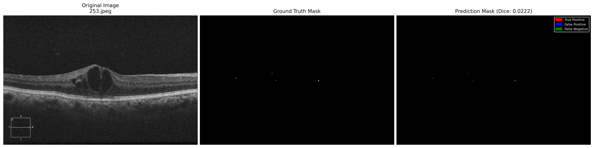
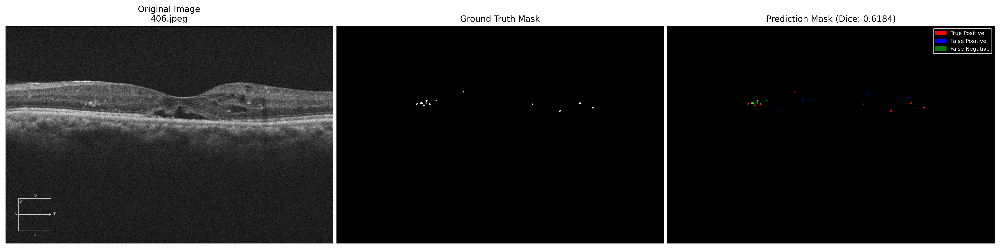
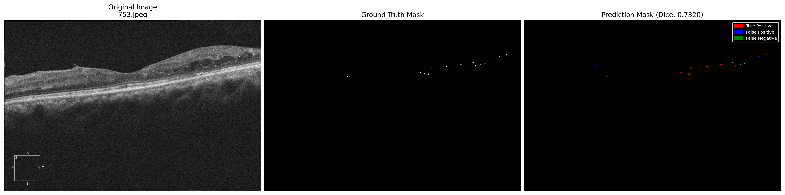

# HRF Segmentation with U-Net and Attention U-Net

[](https://huggingface.co/spaces/AI-RESEARCHER-2024/HRF_Segmentation)

Hyperreflective Foci (HRF) segmentation in OCT retinal images using U-Net and Attention U-Net deep learning models.

## Project Overview

This project implements and compares two state-of-the-art deep learning architectures for automatic segmentation of Hyperreflective Foci (HRF) in Optical Coherence Tomography (OCT) retinal images:

- U-Net: The baseline convolutional neural network architecture for medical image segmentation
- Attention U-Net: An enhanced version with attention gates for improved feature localization

### Key Features

- Dual Model Architecture: Compare U-Net vs Attention U-Net performance
- Live Web Demo: Interactive HuggingFace Space with GPU inference
- Comprehensive Evaluation: Detailed metrics, ROC curves, and confusion matrices
- Reproducible Results: Fixed random seeds and complete training pipeline

---

## Results

### Performance Metrics

| Metric | U-Net | Attention U-Net |
|--------|-------|----------------|
| **Dice Coefficient** | 0.5207 | 0.5033 |
| **Intersection over Union (IoU)** | 0.3655 | 0.3515 |
| **Precision** | 0.4800 | 0.5265 |
| **Recall (Sensitivity)** | 0.6439 | 0.5391 |
| **F1-Score** | 0.5184 | 0.5007 |
| **Specificity** | 0.9998 | 0.9999 |
| **Jaccard Index** | 0.3910 | 0.3695 |
| **Area Under the Curve (AUC)** | 0.8411 | 0.6987 |

> Note: Evaluation was performed on the test set using the training scripts' built-in evaluation pipeline.

### Visual Results

#### ROC Curves & Confusion Matrices

<table>
  <tr>
    <td></td>
    <td></td>
  </tr>
  <tr>
    <td align="center"><b>U-Net</b></td>
    <td align="center"><b>Attention U-Net</b></td>
  </tr>
</table>

#### U-Net Prediction Samples

<table>
  <tr>
    <td></td>
    <td></td>
    <td></td>
    <td></td>
    <td></td>
  </tr>
</table>

#### Attention U-Net Prediction Samples

<table>
  <tr>
    <td></td>
    <td></td>
    <td></td>
    <td></td>
    <td></td>
  </tr>
</table>

---

## Quick Start

### Try the Web Demo

Experience live HRF segmentation in your browser:

**[Launch HuggingFace Space](https://huggingface.co/spaces/AI-RESEARCHER-2024/HRF_Segmentation)**

- Upload OCT images
- Select model (U-Net or Attention U-Net)
- View predictions in real-time
- Download segmentation masks

---

## Repository Structure

```
hrf-segmentation/
├── README.md                          # This file
├── QUICKSTART.md                      # Short setup guide
├── training/                          # Training scripts and code
│   ├── hrfunet.py                    # U-Net training pipeline
│   ├── hrf-aunet.py                  # Attention U-Net training pipeline
│   └── requirements.txt              # Training dependencies
└── results/                           # Training results and model checkpoints
    ├── Unet/                         # U-Net results
    │   ├── best_model.pth            # Best U-Net checkpoint
    │   ├── latest_model.pth          # Latest U-Net checkpoint
    │   ├── test_metrics.csv          # Test set metrics
    │   ├── unetnew.png               # ROC curve & confusion matrix
    │   └── *.png                     # Prediction visualizations
    └── Attention-Unet/               # Attention U-Net results
        ├── best_model.pth            # Best Attention U-Net checkpoint
        ├── latest_model.pth          # Latest Attention U-Net checkpoint
        ├── test_metrics.csv          # Test set metrics
        ├── aunet-new.jpg.png         # ROC curve & confusion matrix
        └── *.png                     # Prediction visualizations
```

---

## Pre-trained Models & Dataset

### Download Pre-trained Weights

Pre-trained model checkpoints are included in the `results/` directory of this repository:

| Model | Path | Size |
|-------|------|------|
| U-Net (Best) | `results/Unet/best_model.pth` | ~355 MB |
| U-Net (Latest) | `results/Unet/latest_model.pth` | ~355 MB |
| Attention U-Net (Best) | `results/Attention-Unet/best_model.pth` | ~361 MB |
| Attention U-Net (Latest) | `results/Attention-Unet/latest_model.pth` | ~361 MB |

Alternatively, download from Google Drive:

**[Download from Google Drive](https://drive.google.com/drive/folders/1J78I28EzEXMD3jNrusWfuQoCFeFhtZsT)**

---

## Installation & Setup

### Local Setup

```bash
# Clone the repository
git clone https://github.com/ai-research-2025/hrf-segmentation.git
cd hrf-segmentation

# Install training dependencies
pip install -r training/requirements.txt

# Download pre-trained models from Google Drive
# Place them in the appropriate directories
```

### Dependencies

Core Requirements:
- Python 3.8+
- PyTorch 1.12+
- CUDA 11.3+ (for GPU training)

See `training/requirements.txt` for detailed dependencies.

---

## Usage

### 1. Training Your Own Models

Both training scripts use a `Config` class at the top of the file for all hyperparameters. Edit the `DATA_DIR` and `CHECKPOINT_DIR` paths before running.

#### Prepare Your Dataset

Organize your data:
```
dataset/
├── HRF_IMAGES/
│   ├── image001.jpeg
│   └── ...
└── HRF_MASKS/
    ├── image001_HRF.ome.tiff
    └── ...
```

#### Train U-Net
```bash
cd training
python hrfunet.py
```

#### Train Attention U-Net
```bash
cd training
python hrf-aunet.py
```

### 2. Inference

#### Web Interface
Use the [HuggingFace Space](https://huggingface.co/spaces/AI-RESEARCHER-2024/HRF_Segmentation) for browser-based inference.

---

## Model Architecture

### U-Net

Classic encoder-decoder architecture with skip connections:
- Encoder: 4 down-sampling blocks (64->128->256->512->1024 filters)
- Decoder: 4 up-sampling blocks with skip connections
- Parameters: ~31M

### Attention U-Net

Enhanced U-Net with attention gates:
- Encoder: Same as U-Net
- Attention Gates: Focus on relevant features from skip connections
- Decoder: Attention-guided up-sampling
- Parameters: ~34M

---

## Methodology

### Preprocessing

**U-Net:**
- CLAHE preprocessing (enhances HRF visibility)
- 0-255 normalization to [0, 1]
- RGB input (3 channels)

**Attention U-Net:**
- CLAHE (Contrast Limited Adaptive Histogram Equalization)
- Z-Score normalization with ImageNet statistics
  - Mean: [0.485, 0.456, 0.406]
  - Std: [0.229, 0.224, 0.225]

> **Note:** Different preprocessing for each model matches their training regime!

### Training Configuration

| Parameter | U-Net | Attention U-Net |
|-----------|-------|----------------|
| **Loss Function** | Focal Tversky Loss (α=0.3, β=0.7, γ=4/3) | Dice Loss (smooth=1.0) |
| **Optimizer** | Adam (lr=1e-3, wd=1e-4) | Adam (lr=1e-3, wd=1e-4) |
| **LR Scheduler** | ReduceLROnPlateau (patience=5) | CosineAnnealing (T_max=100) |
| **Early Stopping** | 25 epochs | 15 epochs |
| **Augmentation** | Flips, ShiftScaleRotate, BrightnessContrast, Gamma | None |
| **Batch Size** | 4 | 4 |
| **Epochs** | 100 | 100 |

- Data Split: 70% Train / 15% Validation / 15% Test
- Random Seed: 42 (for reproducibility)
- Mixed Precision Training (AMP): Enabled

---

## Evaluation Metrics

Both training scripts automatically evaluate on the test set and generate:

1. Segmentation Metrics
   - Dice Coefficient
   - IoU (Jaccard Index)
   - Precision, Recall, F1-Score
   - Specificity

2. Classification Metrics
   - ROC-AUC curves
   - Confusion matrices
   - True/False Positives/Negatives

3. Visualizations
   - Side-by-side predictions (Image, Ground Truth, Prediction)
   - ROC curve and confusion matrix plots
   - Results saved to CSV

---

## HuggingFace Deployment

The live demo is deployed on HuggingFace Spaces. You can access it directly to test the models with your own images.

**Live Demo**: [HuggingFace Space](https://huggingface.co/spaces/AI-RESEARCHER-2024/HRF_Segmentation)

---

## Contributing

Contributions are welcome! Please feel free to submit a Pull Request.

### Development Setup

```bash
# Create virtual environment
python -m venv venv
source venv/bin/activate  # On Windows: venv\Scripts\activate

# Install development dependencies
pip install -r requirements.txt
```

---

## Citation

If you use this code in your research, please cite:

```text
Pavithra Kodiyalbail Chakrapani, Preetham Kumar, Sulatha V Bhandary, 
Geetha Maiya, Shailaja S, Steven Fernandes, Prakhar Choudhary. 
"U-Net Optimization for Hyperreflective Foci Segmentation in Retinal OCT"
```

---

## License

This project is licensed under the MIT License - see the LICENSE file for details.

---

## Acknowledgments

- U-Net architecture based on Ronneberger et al., 2015
- Attention U-Net based on Oktay et al., 2018
- The authors acknowledge the usage of retinal OCT images from the Department of Ophthalmology, Kasturba Medical College, Manipal Academy of Higher Education, Manipal, India.

---

## Contact

For questions or feedback:
- Issues: [GitHub Issues](https://github.com/ai-research-2025/hrf-segmentation/issues)
- Discussions: [GitHub Discussions](https://github.com/ai-research-2025/hrf-segmentation/discussions)

---

## Quick Links

| Resource | Link |
|----------|------|
| **Live Demo** | https://huggingface.co/spaces/AI-RESEARCHER-2024/HRF_Segmentation |
| **Pre-trained Models** | https://drive.google.com/drive/folders/1J78I28EzEXMD3jNrusWfuQoCFeFhtZsT |
| **Paper (U-Net)** | https://arxiv.org/abs/1505.04597 |
| **Paper (Attention U-Net)** | https://arxiv.org/abs/1804.03999 |

---

<p align="center">
  <b>Star this repository if you found it helpful!</b>
</p>
